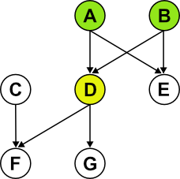

# Dependency ordering
Kapps (applications) often need installing in a particular order, especially if you're creating a cluster from scratch. You'd need to create public hosted zones before you could create public DNS entries for your services, or perhaps create a database before installing your web application.

To enable Sugarkube to install and delete kapps in the correct order, you need to tell it about each kapp's dependencies, which it uses to create a dependency graph or [DAG](https://en.wikipedia.org/wiki/Directed_acyclic_graph). 



The algorithms to install or delete kapps using the DAG are simple:

* A kapp will only be installed if it either has no parents, or if all its parents have been installed. 
* A kapp will only be deleted if it either has no children, or if all its children have been deleted.

In the above image, D will only be installed once A and B have both been installed. C can also be installed because it has no parents. Similarly, D will only be deleted once F and G have been deleted, and E can be deleted because it has no children.

## Defining ordering
[Stacks](stacks.md) are grouped into manifests. As a shortcut for when all kapps in a manifest need to be installed sequentially, define the option `sequential: true` for the whole manifest, e.g.:
```
# manifests/manifest1.yaml
options:
  sequential: true      # kapps in this manifest must be installed in order
kapps:
  # ... define your kapps here
```

If there's no need for all the kapps in a manifest to be installed sequentially, you can declare a list of kapps that a kapp requires with the `depends_on` key, e.g.
```
# manifests/web.yaml
defaults:
  depends_on:       # defaults for all kapps in this manifest
  - routing:load-balancer

kapps:
- id: database
  state: present
  sources: 
  # ...
  
- id: memcached
  state: present
  sources: 
  # ...
  
- id: wordpress
  state: present
  sources: 
  # ...
  depends_on:
  - database
  - memcached

- id: analytics
  state: present
  sources: 
  # ...
```
In this definition, the `database`, `memcached` and `analytics` kapps can all be installed in parallel once the `routing:load-balancer` kapp in the `routing` manifest has been installed. The `wordpress` kapp will only be installed once the `database` and `memcached` kapps have been installed. The advantage of declaring kapps this way is that it allows them to be installed in parallel once their dependencies have been met.

All the `sugarkube kapps <subcommand>` subcommands build a DAG and traverse it when performing operations.  

# Selecting subsets of the DAG
The DAG encapsulates the global set of dependencies between kapps in a target stack. Sometimes though you just want to work with a subset of the DAG, e.g. to install or delete one or two specific kapps. This is possible with selectors.

Selectors are simply the fully-qualified ID of a kapp, which is of the form `<manifest ID>:<kapp ID>`. They can be used to include (with the `-i` flag) or exclude (`-x`) kapps from being operated on. The flag can be passed multiple times to include or exclude multiple kapps, e.g.:
```
sugarkube kapps install -i web:analytics -i web:wordpress
```

You can also use the wildcard symbol `*` to select all kapps in a manifest, e.g. `web:*` (make sure to quote this on the command line though to prevent tripping up your shell).

Internally Sugarkube first builds a DAG from the global set of dependencies, then extracts a subgraph containing just the parents of the selected kapps.
