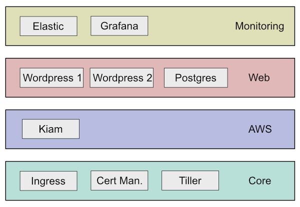

# Manifests
Manifests let you group related kapps together: 



They make it easy to set defaults for, and to [select](dependencies.md) related kapps to work with. 

The above example shows 4 manifests. You could install a cluster but exclude all monitoring kapps with `-x 'monitoring:*'`. Or you could simply comment out the monitoring manifest from the list of manifests defined for your dev cluster if you didn't need them.

## Configuration
Manifests can contain the following settings:

* defaults - set default values for kapps for the whole manifest (see below)
* options - currently the only supported option is `sequential` which informs Sugarkube that each kapp depends on the previous one. See [dependencies](dependencies.md) for more.
* kapps - the configs for the kapps in the manifest. You can override any setting defined in the kapp. The only required setting is `sources` which is used when building a [workspace](workspaces.md) to download kapps. 

## Defaults
You can define default kapp values at the manifest level. So if you have some variables used by a lot of kapps in the manifest, you could set their value once, e.g.:
```
defaults:
  vars:
    tiller_namespace: "{{ .stack.cluster }}"

``` 

## Example
An example manifest is as below:
```
options:
  sequential: true      # kapps in this manifest must be installed in order
  
defaults:
  vars: 
    size: medium
  
kapps:
  - id: demo-kapp       # Manifest-unique identifier
    state: present
    - uri: git@github.com:sugarkube/kapps.git//incubator/demo-kapp#1.2.3
    - uri: git@github.com:sugarkube/kapps.git//incubator/common-makefiles#1.0.0
  vars:
    size: small
    hostname: "{{ .stack.cluster }}.localhost"
```
